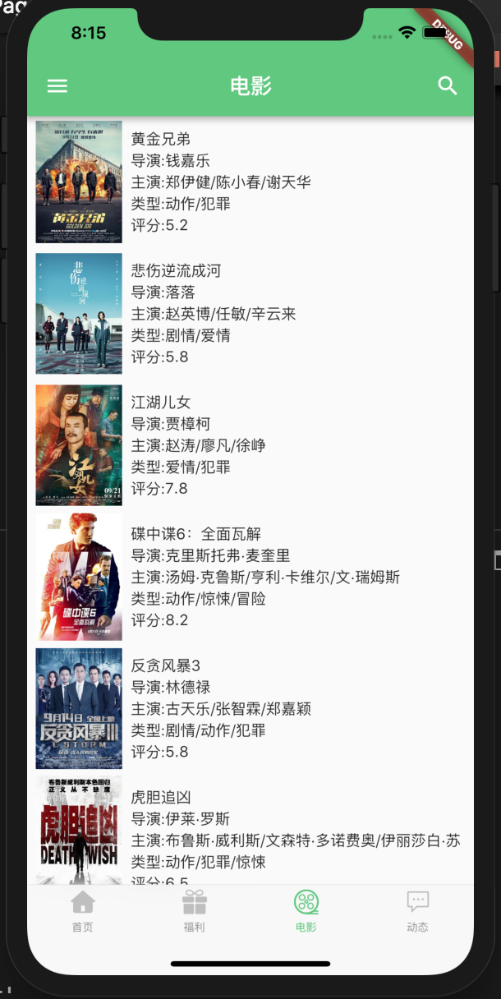

# flutter_driver
- 采用google 最新推出的跨平台框架 flutter 开发的 Android iOS 版app,
- [GitHub戳这里](https://github.com/huangjie01/flutter_driver) 
- [关于Google Flutter](https://flutter.io)

# 说明
 - 电影数据来源于豆瓣电影开放API
 - 福利图片来源于 干货开放API
  

# 功能
-  首页界面开发中，敬请期待
-  福利界面支持下拉刷新或分页加载
-  福利图片预览界面开发中
-  电影界面支持下拉刷新
-  电影详情界面开发中，敬请期待
-  动态界面开发中，敬请期待
-  换肤开发中，敬请期待
-  设置界面开发中，敬请期待
-  关于界面开发中，敬请期待

# 截图部分
#### iOS

    
    
    
    

